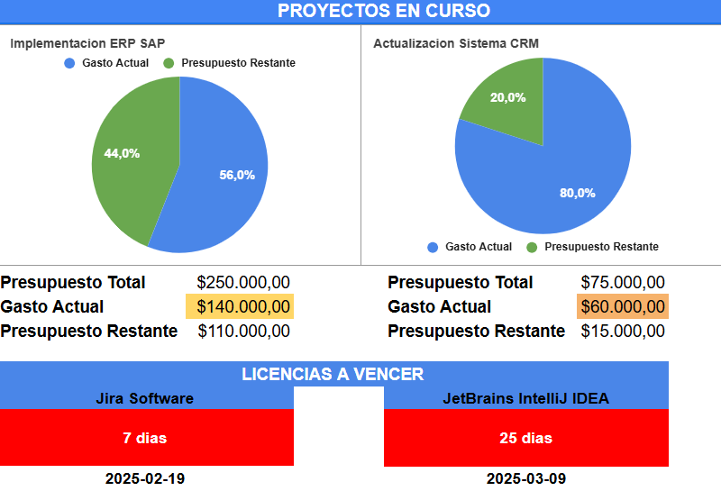
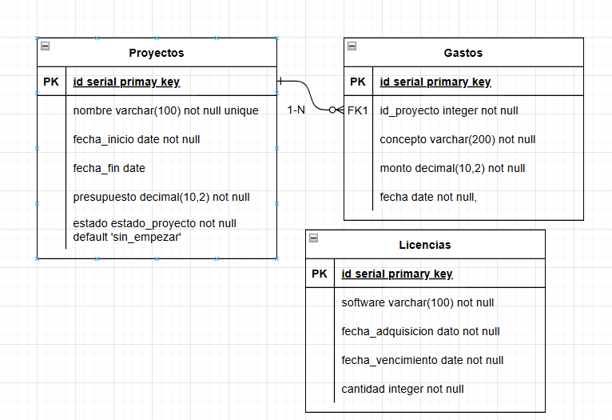
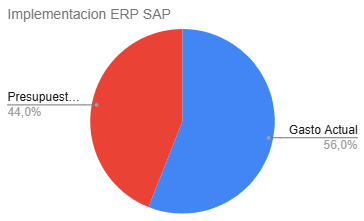
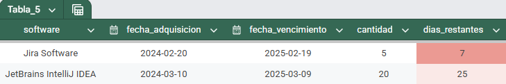

# Documentación del Proyecto de Dashboard PMO

## Introducción y Objetivo General


Este proyecto surge ante la necesidad de contar con una herramienta que centralice y visualice los indicadores clave en la gestión de proyectos de TI, tales como el presupuesto, el gasto actual y la administración de licencias. El dashboard PMO está diseñado para facilitar la toma de decisiones y mejorar la estandarización de proyectos. Además, cumple con los requerimientos de la vacante a la que aspiro, al demostrar habilidades en SQL y el manejo de herramientas como Google Sheets.

## Objetivo Principal

El objetivo del dashboard es consolidar y presentar de manera clara la información esencial sobre la gestión de proyectos y licencias. Para ello, se incluyen las siguientes funcionalidades:

### Gestión de Proyectos

- **Visualización del presupuesto:**  
  Un gráfico circular muestra el porcentaje del presupuesto utilizado. Además, se presentan los valores absolutos de presupuesto total, gasto actual y presupuesto restante para cada proyecto.

### Seguimiento de Licencias

- **Vencimientos:**  
  Se detalla la cantidad de días restantes para el vencimiento y la fecha exacta de expiración de cada licencia, permitiendo anticipar renovaciones y prevenir interrupciones en el servicio.

## Alcance del Proyecto

### Incluido

- **Importación de Datos:**  
  Carga manual desde la base de datos online PostgreSQL (Supabase) a Google Sheets mediante exportación e importación de archivos CSV.

- **Indicadores Calculados:**  
  - Porcentaje de presupuesto utilizado.  
  - Gasto actual, presupuesto total y presupuesto restante.  
  - Días restantes y fecha de vencimiento de licencias.

- **Visualización:**  
  Dashboard estático con actualización manual de datos.

### No Incluido

- Automatización de la importación de datos.  
- Indicadores avanzados o análisis de tendencias históricas.  
- Integraciones automáticas con otros sistemas de gestión.  
- Funcionalidades interactivas avanzadas (filtros, actualización en tiempo real).

> **Nota:** Este proyecto es una prueba de concepto orientada a demostrar habilidades básicas en SQL, en el manejo de herramientas como Google Sheets y en la estructuración y visualización de información crítica para la gestión de proyectos.

## Herramientas Utilizadas

- **Base de Datos:**  
  **Supabase (PostgreSQL)**  
  Se eligió Supabase por su capacidad de integración futura con Google Sheets para la actualización automática de datos. Inicialmente se consideró ElephantSQL, pero fue descartado debido a su inminente discontinuación.

- **Hoja de Cálculo:**  
  **Google Sheets**  
  Se utilizó Google Sheets como plataforma para la visualización de los datos exportados desde la base de datos.

- **Lenguaje y Consultas:**  
  **SQL**  
  Se empleó SQL para la extracción y manipulación de datos, aprovechando experiencia previa en la creación de consultas CRUD para una API REST. No se utilizaron otros scripts adicionales.

## Diseño de la Base de Datos

### Estructura de Tablas

#### Tabla: Proyectos

- **ID**  
  - **Tipo:** `SERIAL PRIMARY KEY`  
  - **Descripción:** Identificador único del proyecto.
- **Nombre**  
  - **Tipo:** `TEXT`  
  - **Descripción:** Nombre del proyecto.
- **Fecha de Inicio**  
  - **Tipo:** `DATE`  
  - **Descripción:** Fecha de inicio del proyecto.
- **Fecha de Fin**  
  - **Tipo:** `DATE`  
  - **Descripción:** Fecha estimada de finalización.
- **Presupuesto**  
  - **Tipo:** `DECIMAL(10,2)`  
  - **Descripción:** Monto total asignado al proyecto.
- **Estado**  
  - **Tipo:** `estado_proyecto (ENUM)`  
  - **Descripción:** Estado actual del proyecto, con valores posibles: `'sin_empezar'`, `'en_progreso'`, `'terminado'`.

#### Tabla: Gastos

- **ID**  
  - **Tipo:** `SERIAL PRIMARY KEY`  
  - **Descripción:** Identificador único del gasto.
- **Proyecto Asociado**  
  - **Tipo:** `INTEGER` (Referencia a `proyectos.id`)  
  - **Descripción:** Identificador del proyecto al que pertenece el gasto.
- **Concepto**  
  - **Tipo:** `TEXT`  
  - **Descripción:** Descripción del gasto.
- **Monto**  
  - **Tipo:** `DECIMAL(10,2)`  
  - **Descripción:** Monto del gasto.
- **Fecha**  
  - **Tipo:** `DATE`  
  - **Descripción:** Fecha en la que se realizó el gasto.

#### Tabla: Licencias

- **ID**  
  - **Tipo:** `SERIAL PRIMARY KEY`  
  - **Descripción:** Identificador único de la licencia.
- **Nombre del Software**  
  - **Tipo:** `TEXT`  
  - **Descripción:** Nombre del software licenciado.
- **Fecha de Adquisición**  
  - **Tipo:** `DATE`  
  - **Descripción:** Fecha en la que se adquirió la licencia.
- **Fecha de Vencimiento**  
  - **Tipo:** `DATE`  
  - **Descripción:** Fecha en la que expira la licencia.
- **Cantidad**  
  - **Tipo:** `INTEGER`  
  - **Descripción:** Número de licencias adquiridas.

### Relaciones entre Tablas

- La tabla **gastos** tiene una relación de uno a muchos con **proyectos** (un proyecto puede tener múltiples gastos).
- La tabla **licencias** se gestiona de forma independiente, sin relaciones directas con las otras.


### Tipo ENUM para Proyectos

```sql
CREATE TYPE estado_proyecto AS ENUM ('sin_empezar', 'en_progreso', 'terminado');
```

**Descripción:**  
Este tipo se utiliza en la columna `estado` de la tabla **proyectos** para restringir los valores a los predefinidos, garantizando la consistencia de la información.

## Consultas SQL Principales

### 1. Obtener el gasto total por proyecto y su porcentaje de avance

```sql
SELECT p.id, p.nombre AS nombre_proyecto, p.presupuesto,
       COALESCE(SUM(g.monto), 0) AS total_gastado,
       ROUND(COALESCE(SUM(g.monto) * 100.00 / p.presupuesto, 0), 2) AS porcentaje_avance
FROM proyectos p 
LEFT JOIN gastos g ON p.id = g.id_proyecto
WHERE p.id = 1
GROUP BY p.id, p.nombre, p.presupuesto;
```

**Explicación:**  
Calcula el total de gastos para un proyecto específico (en este caso, `id = 1`) y el porcentaje de avance basado en la relación entre los gastos y el presupuesto total.

### 2. Filtrar licencias que vencen en los próximos 30 días

```sql
SELECT software, fecha_vencimiento, cantidad,
       (fecha_vencimiento - CURRENT_DATE) AS dias_restantes
FROM licencias
WHERE (fecha_vencimiento - CURRENT_DATE) <= 30
      AND fecha_vencimiento >= CURRENT_DATE
ORDER BY dias_restantes ASC;
```

**Explicación:**  
Obtiene las licencias cuyo vencimiento está dentro de los próximos 30 días, filtrando aquellas que aún no han vencido y ordenándolas por los días restantes.

### 3. Obtener presupuesto y gastos de proyectos en curso

```sql
SELECT p.nombre AS nombre_proyecto, p.presupuesto,
       COALESCE(SUM(g.monto), 0) AS gasto_actual
FROM proyectos p
LEFT JOIN gastos g ON p.id = g.id_proyecto
WHERE p.estado = 'en_progreso'
GROUP BY p.id, p.nombre, p.presupuesto
ORDER BY gasto_actual DESC;
```

**Explicación:**  
Lista los proyectos en curso, mostrando el presupuesto y el gasto acumulado, y ordena los proyectos de mayor a menor gasto actual.

### 4. Listar todas las licencias activas ordenadas por vencimiento

```sql
SELECT software, fecha_adquisicion, fecha_vencimiento, cantidad,
       (fecha_vencimiento - CURRENT_DATE) AS dias_restantes
FROM licencias
WHERE fecha_vencimiento >= CURRENT_DATE
ORDER BY dias_restantes ASC;
```

**Explicación:**  
Devuelve todas las licencias activas, ordenadas por la fecha de vencimiento, lo que ayuda a visualizar qué licencias expiran primero.

## Estructura del Dashboard (Google Sheets)

Para la visualización y el análisis de los datos, se han creado **cuatro hojas** dentro del mismo archivo de Google Sheets, cada una con un propósito específico:

### Hoja “Tablas”

- **Contenido:**  
  Tres tablas separadas que reflejan la información de cada entidad de la base de datos: **Proyectos**, **Gastos** y **Licencias**.
- **Objetivo:**  
  Servir como referencia y permitir la consulta rápida de los datos crudos exportados manualmente desde Supabase.

### Hoja “Gasto/Proyecto”

- **Contenido:**  
  - Una tabla que muestra los proyectos en progreso, con columnas de **Presupuesto** y **Gasto Actual** obtenidas de una consulta SQL.
  - Dos gráficas circulares que comparan visualmente el gasto actual frente al presupuesto total.
- **Objetivo:**  
  Permitir una lectura rápida de cuánto se ha consumido del presupuesto para cada proyecto y detectar posibles riesgos de sobrepaso.

### Hoja “Inventario Licencias”

- **Contenido:**  
  Una tabla resultante de la consulta de licencias próximas a vencer (días restantes ≤ 30).  
  Cada fila incluye el nombre del software, los días restantes y la fecha exacta de vencimiento.
- **Objetivo:**  
  Destacar cuáles licencias requieren atención inmediata o renovación para prevenir interrupciones en el servicio.

### Hoja “Dashboard”

- **Contenido:**  
  Una vista consolidada de los principales indicadores de proyectos y licencias, que incluye:  
  - Las gráficas circulares de Presupuesto vs. Gasto Actual.
  - Una sección que muestra las licencias a vencer, con días restantes y fecha de vencimiento.
- **Objetivo:**  
  Proporcionar una visión global y rápida del estado de los proyectos y la situación de las licencias en una sola pantalla, facilitando la toma de decisiones.

## Indicadores y Gráficos

- **Gráficas Circulares (Gasto/Proyecto):**  
  Muestran de manera visual la proporción del gasto respecto al presupuesto total, ayudando a identificar rápidamente el porcentaje consumido en cada proyecto.

- **Tablas y Formatos Condicionales (Licencias):**  
  Las licencias con menos de 30 días para vencer se destacan mediante celdas con matices de rojo, facilitando el seguimiento y la priorización de renovaciones.

> **Ejemplo de Gráfica Circular:**  


> **Ejemplo de Tabla con Formato Condicional:**  


## Flujo de Datos

- **Exportación de Consultas:**  
  Los datos se obtienen ejecutando consultas SQL en Supabase. Los resultados se exportan a archivos en formato CSV.

- **Importación a Google Sheets:**  
  Se importan manualmente los archivos CSV a las hojas de Google Sheets, actualizando la información según el último estado extraído de la base de datos.

- **Visualización y Actualización de Gráficos:**  
  - **Creación de Gráficos Estáticos:**  
    Los gráficos se generan directamente a partir de los datos importados y se copian/pegan en la hoja "Dashboard".  
  - **Actualización Manual:**  
    Tanto la importación de datos como la actualización de los gráficos se realizan manualmente en la versión actual del proyecto.

- **Integraciones Futuras:**  
  Se reconoce la posibilidad de automatizar la conexión entre Supabase y Google Sheets mediante el uso de Google Apps Script u otras herramientas de terceros, lo que permitiría actualizar los datos y gráficos en tiempo real.

## Conclusiones y Mejoras Futuras

### Resumen de lo Logrado

- Se implementó un dashboard PMO que centraliza y visualiza la información crítica de la gestión de proyectos y licencias.
- Los datos se extrajeron de Supabase mediante consultas SQL y se exportaron a Google Sheets en archivos CSV.
- Se crearon hojas específicas para mostrar:
  - La información cruda de las tablas (Proyectos, Gastos y Licencias).
  - El gasto actual versus el presupuesto en proyectos en progreso, mediante tablas y gráficos circulares.
  - El seguimiento de licencias próximas a vencer, con indicadores de días restantes y fecha de expiración.
- Se consolidó una vista general (Dashboard) que integra estos elementos para facilitar la toma de decisiones.

### Retos Encontrados

- **ElephantSQL:**  
  Inicialmente se consideró usar ElephantSQL, pero al enterarse de su inminente discontinuación, se optó por Supabase como alternativa.
  
- **Importación de Datos:**  
  El desafío de actualizar la información desde la base de datos a Google Sheets se resolvió mediante la exportación de resultados en formato CSV y su importación manual.

### Mejoras a Implementar

- **Automatización de la Carga de Datos:**  
  Integrar scripts o herramientas (por ejemplo, Google Apps Script) para actualizar los datos de forma automática desde Supabase a Google Sheets.
  
- **Ampliación de KPIs:**  
  Incluir indicadores adicionales que proporcionen un análisis más detallado del rendimiento de los proyectos, como tendencias históricas, proyecciones y otros análisis financieros.
  
- **Extensión del Dashboard:**  
  Incorporar información adicional relevante que permita una toma de decisiones más completa, integrando nuevos gráficos y resúmenes que reflejen aspectos críticos de la gestión de proyectos.

## Referencias y Links

- **ChatGPT:**  
  Utilicé ChatGPT para aclarar conceptos, sugerir correcciones y obtener recomendaciones sobre herramientas y metodologías de implementación.
  
- **Tutoriales en YouTube:**  
  Diversos tutoriales de Google Sheets me ayudaron a comprender y aplicar técnicas de visualización y configuración de gráficos.
  
- **Recursos en línea sobre SQL:**  
  Consulté páginas y foros especializados en SQL para solucionar dudas y mejorar mis consultas.

- **Archivo de Google Sheets (Dashboard PMO):**  
  [Enlace a Google Sheets](https://docs.google.com/spreadsheets/d/1iLvIKTCs-zVm-r1Fc6eEA5iFjcUZBEZcVe6yIS4yAYU/edit?usp=sharing)

- **Script de SQL:**  
  [Enlace al Script SQL en GitHub Gist](https://gist.github.com/buscarons/da9fc8a30b09e4fd25493bd746210ddc)
